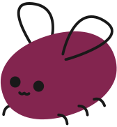

<!--lint disable awesome-git-repo-age-->

<!-- title -->

# Awesome Cohost  

<!-- subtitle -->

An awesome list of things related to cohost.

<!-- image -->

<!-- description -->

[cohost](https://cohost.org) is a new social media platform built from the ground up by a small team of developers and designers who like sharing things on the internet.

<!-- TOC -->

## Contents

- [Bots](#bots)
- [Client customisation](#client-customisation)
- [Post Generators](#post-generators)
- [API Libraries](#api-libraries)
- [Automation & Tools](#automation--tools)
- [Tutorials & Guides](#tutorials--guides)
- [Follow](#follow)

<!-- CONTENT -->

## Bots
- [@coloroftheday](https://cohost.org/coloroftheday) - Bot that posts a new colour every day.
- [@verge-ebooks](https://cohost.org/verge-ebooks) - Tech news from a parallel universe.
- [@gamemagprintads](https://cohost.org/gamemagprintads) - Game history, one ad at a time.
- [@randochrontendo](https://cohost.org/randochrontendo) - A random screenshot from the chronogaming project Chrontendo every 30 minutes.

## Client customisation
- [Skeuohost](https://userstyles.world/style/5982/skeuohost) - Userstyle for Cohost.
- [better comment userstyle](https://cohost.org/lexi/post/541722-babe-wake-up-new-use) - Better comment indent.
- [Notification Names userscript](https://cohost.org/lexi/post/514085-hey-so-if-you-rememb) - Add usernames to notifications.
- [Mutant Standard emoji](https://mutant.us.to/) - Use the Mutant Standard emoji set on Cohost.
- [view source userscript](https://cohost.org/amgg/post/72548-view-source-userscri) - A userscript that adds a "view source" button to posts.
- [Notification Popover userscript](https://cohost.org/blep/post/51879-waht-if-notification) - Adds a lil notification popover.

## Post Generators

- [Backloggd formatter](https://nex3.github.io/cohost-backloggd/) - Create pretty cohost posts of [backloggd](https://www.backloggd.com/) reviews.
- [Cohoard](https://a2aaron.github.io/Cohoard/) - Format chatlogs for Cohost.
- [prechoster](https://cloudwithlightning.net/random/chostin/prechoster/) - A graph-based HTML generator to make fancy chosting easier.
- [markdown PLUS](https://oat.zone/markdown-plus/) - An "alternative" to markdown for cohost which lets you use fucked-up text in your everyday posts.
- [choll](https://choll.clown.dev/) - Cholls are polls for your chosts.
- [bugpoll](https://a.ktrv.dev/) - Polls directly on Cohost.

## API Libraries
- [eggbug-rs](https://github.com/iliana/eggbug-rs) - A bot library for Cohost, providing an interface to create, read, edit, and delete posts.
- [libcohost](https://github.com/JaycieErysdren/libcohost) - A C / C++ library for interacting with Cohost.
- [cohost.js](https://github.com/mogery/cohost.js) - Unofficial API for Cohost.
- [cohost.py](https://github.com/valknight/cohost.py) - A python library for Cohost.

## Automation & Tools
- [Twitter Crossposter](https://cohost.org/lexi/post/157283-okay-so-if-you-want) - Tweet your new Cohost posts.

## Tutorials & Guides
- [Escape characters](https://cohost.org/lexi/post/386344-cohost-tip-you-can) - How to post angle brackets and other special characters with escaping.
- [Fixed backgrounds](https://cohost.org/lexi/post/368067-you-guys-seem-to-rea) - How to use fixed backgrounds for CSS Crimes.
- [CSS AJAX](https://cohost.org/lexi/post/255262-yes-css-can-do-ajax) - Yes, CSS can do AJAX. Here's how.
- [Custom 'Read More'](https://cohost.org/lexi/post/68227-i-have-the-power-of) - Create custom 'Read More' tags with CSS.
- [Code syntax highlighting](https://cohost.org/lexi/post/54367-cohost-does-not-have) - Simple code syntax highlighting.
- [css for css baby 1: stupid text tricks](https://cohost.org/lexyeevee/post/495441-css-for-css-baby-1) - So You Want To Know CSS.
- [css for css baby 2: boxes and blocks and stuff](https://cohost.org/lexyeevee/post/507300-css-for-css-baby-2) - Part two of the series.

<!-- END CONTENT -->

## Follow

<!-- list people worth following on social sites (Twitter, LinkedIn, GitHub, YouTube etc.) -->

Who else should we be following!?

## Contributing

[Contributions of any kind welcome, just follow the guidelines](contributing.md)!

### Contributors

[Thanks goes to these contributors](https://github.com/ineffyble/awesome-cohost/graphs/contributors)!
